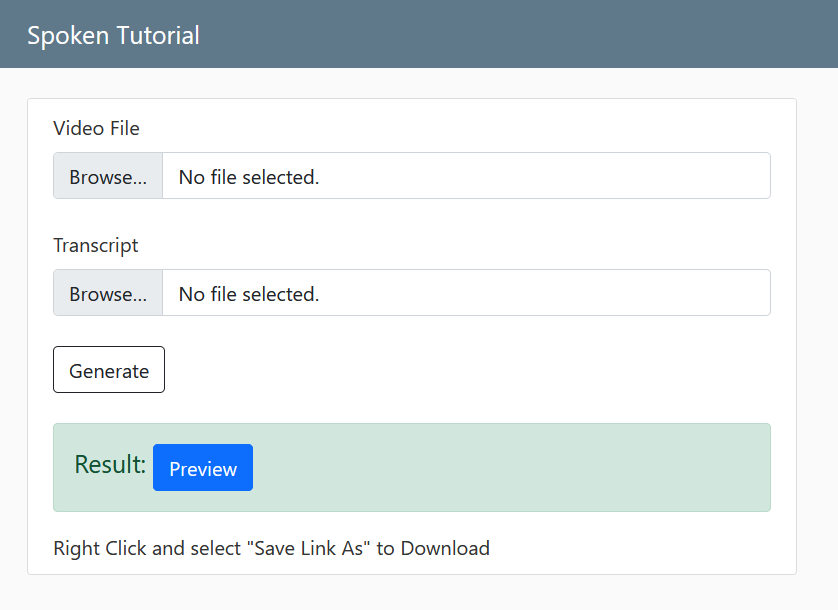

# Spoken Tutorial

## Motivation

Built for the [screening phase](https://spoken-tutorial.org/stinternship2022/autogeneration/) of the FOSSEE program under Python.

## This branch uses gtts as a test

## Technologies/Frameworks Used

- [ffmpeg-python](https://kkroening.github.io/ffmpeg-python/)
- [Django](https://www.djangoproject.com/)
- [gtts](https://gtts.readthedocs.io/)

**Why function based views instead of class based views?**  
Personal preference. I find function based views more clear and verbose in what they do as compared to class based (magic) views.

**Why pyttsx3?**  
Other options were gTTS which did not have male/female voice options, and Google Cloud TTS / IBM Watson, neither of which are easily accessible (require banking information). So this module became the go to choice.

## Wireframe

## Instructions

### Pre-requisites

#### Download ffmpeg

> [Windows](https://www.gyan.dev/ffmpeg/builds/ffmpeg-release-essentials.7z)
>
> [Mac](https://evermeet.cx/ffmpeg/ffmpeg-5.0.7z)
>
> Linux - just run `sudo apt-get install ffmpeg` or equivalent for your distro.

> `ffmpeg` should be in your $PATH, [video tutorial for windows](https://mega.nz/file/uQkiBZ7Z#A_pulEQLqvt98hANtbePO5g4nw2Wtoh0-f9Si1yJ-ss).

Install requirements

> `pip install -r requirements.txt`

Run migrate command

> `python manage.py migrate`

### Running

Run using

> `python manage.py runserver`

### Open in browser

Visit [localhost](http://localhost:8000).

## Screenshots

## How to use?

- There is only one page where you can upload video and transcript files.
- It should give a Preview button after clicking Generate, if something went wrong either ffmpeg is not in path or uploaded files are invalid.
> Any video file that ffmpeg can process is valid.  
> Check Example Files folder for CSV contents.
- Example Files [here](example_files).